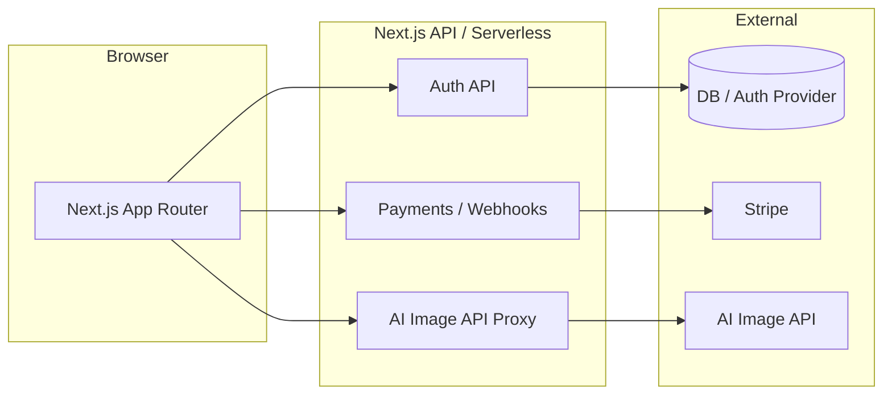

# Orchestra Project Plan

**Goal:** Browser-based web app where users sign up, log in, buy tokens, generate Bauhaus-style AI art, and download the result.

**Recommended stack:** Next.js (React) on Vercel — one codebase, API routes for auth/payments/AI, no mobile version needed.

---

## V0.1 scope and readiness

**V0.1** = Orchestra with:

- Placeholder **Bauhaus-style image generator** (no AI yet).
- Placeholder **Inspiration** page with a placeholder **inspiration feed** (real content later).
- **Forgot password:** UI only (modal in same style as auth); no send-email / reset flow until later.
- **Payments:** Stripe **Checkout redirect** (user redirects to Stripe, then back to app). **V0.2** will add Payment Element in-modal.

**Phase 1** creates the design system and initial layout **from Figma** (tokens, landing, pricing, etc.). Ensure `design-system.json` (or equivalent tokens) and repo structure are created from Figma in Phase 1.

---

## Architecture (high level)

- **Frontend:** Next.js App Router, React, styling aligned with [design-system.json](design-system.json) (or re-create from Figma if file is missing).
- **Backend:** Next.js API routes (or Route Handlers) for auth callbacks, Stripe checkout/webhooks, and proxied AI generation (keys never in browser).
- **Data:** Use your chosen auth provider's user store (e.g. NextAuth + database adapter); optional small DB or Vercel KV/Postgres for token balance and generation history.

---

## Phase 1: Foundation and landing

- **1.1** Initialize Next.js app (TypeScript, App Router, no mobile).
- **1.2** Add design tokens: **create from Figma** — load or re-create `design-system.json` and expose via **raw CSS** (CSS custom properties in `:root` + utility/component classes in a global stylesheet). No Tailwind.
- **1.3** Implement static marketing layout **from Figma**: header, footer, hero, feature blocks, pricing section (no checkout yet), and basic responsive behavior. Include nav/link to Inspiration page.
- **1.4** Set up project structure: `/app` (routes), `/components`, `/lib` (auth, api client, tokens), `/styles`, and config (env, feature flags if needed).

**Outcome:** Deployable landing page that looks like the Orchestra Figma and uses the design system.

---

## Phase 2: Auth (sign up / log in)

- **2.1** Add NextAuth.js (Auth.js) with **credentials only** (email + password). No social providers (Google/Apple) for now.
- **2.2** Persist users: configure a database adapter (e.g. Prisma + Postgres, or Supabase) for sessions and user records.
- **2.3** Build auth UI from Figma: **one auth modal** with a **toggle** ("Log in" / "Sign up") just below the image to switch between login and sign-up states; the modal expands vertically when toggled (e.g. sign-up has more fields). Add a **Forgot password** modal in the same style (overlay, layout, inputs, CTA) as the auth modal, triggered from "Forgot password?" on the login state — **V0.1: UI only** (no send-email / reset flow yet). **After sign-in or sign-up:** redirect user back to the **landing page**, which then shows the **"Signed in" top bar** (replace logged-out header). **Signed-in header reference:** [Figma — Orchestra, node 41-4594](https://www.figma.com/design/2VNLq4dbjgosY7IWV2WQL5/Orchestra?node-id=41-4594&m=dev). **Auth modal look-and-feel:** [Figma — Orchestra, node 41-4456](https://www.figma.com/design/2VNLq4dbjgosY7IWV2WQL5/Orchestra?node-id=41-4456&m=dev).
- **2.4** Protect routes: middleware or layout checks so "Buy tokens" and "Generate" are only available when signed in; redirect unauthenticated users to login or landing.

**Outcome:** Users can sign up, log in, and see protected app content.

---

## Phase 3: Tokens and payments

**Token economy (fixed):**

| Pack         | Price | Tokens (generated pictures) |
| ------------ | ----- | --------------------------- |
| **Test**     | €1    | 1                           |
| **Standard** | €25   | 30                          |
| **Premium**  | €50   | 70                          |

In the image generator: **1 prompt = 1 generated picture = 1 token spent.**

- **3.1** Implement token model: store balance per user (DB or auth provider metadata). One token = one generation; deduct 1 token per prompt when the generator is implemented.
- **3.2** Integrate Stripe: three products — **Test** (€1, 1 token), **Standard** (€25, 30 tokens), **Premium** (€50, 70 tokens). **V0.1:** use **Checkout redirect** (create Checkout Session → user pays on Stripe → return to success URL). **V0.2:** add Payment Element in-modal.
- **3.3** Webhook: Stripe webhook endpoint to listen for successful payment and credit the user's token balance with the correct amount per pack.
- **3.4** UI: "Buy tokens" flow from landing or header, success/cancel redirects, and display current token balance in header.

### Buy tokens modal — logic

The modal has **two steps**. Which step opens first depends on how the user entered.

- **Step 1 — Select token pack:** User sees the three packs — **Test** (€1, 1 picture), **Standard** (€25, 30 pictures), **Premium** (€50, 70 pictures) — and chooses one. **Figma reference (Step 1):** [Orchestra, node 45-5503](https://www.figma.com/design/2VNLq4dbjgosY7IWV2WQL5/Orchestra?node-id=45-5503&m=dev). After selection, move to Step 2.
- **Step 2 — Payment (card details):** Selected pack is visible in the modal; user enters card details ("Your card details" / "Add your card details to purchase membership"). **Figma reference (Step 2):** "B1 Payment Container" in Figma.

**Entry paths:**

- **Landing page — "Get started" on a pack (below Pricing):** Open the Buy token pack modal at **Step 2** with that pack already selected and visible in the modal (same as B1 Payment Container).
- **Out of tokens, or click from header/UI:** When the user runs out of tokens or clicks the buy-tokens entry point (e.g. in signed-in header), open the modal at **Step 1** so they can choose which pack to buy. **Figma reference (entry that opens Step 1):** [Orchestra, node 41-4601](https://www.figma.com/design/2VNLq4dbjgosY7IWV2WQL5/Orchestra?node-id=41-4601&m=dev).

**Rest of flow (unchanged):** **V0.1:** Stripe **Checkout redirect** (create Session, redirect to Stripe, handle success/cancel return). **V0.2:** Payment Element in-modal. On success: close modal (or return from Stripe), show success, refresh balance in header. On cancel/close: no balance change. On error: show inline, allow retry. Auth guard: if not signed in when opening from pricing, prompt login then resume.

**Outcome:** Users can buy tokens; balance updates after payment and is visible in the app.

---

## Phase 4: Bauhaus-style AI generation and download (placeholder for now)

- **4.1** For now: implement a **placeholder screen** only (e.g. "Generate" route with a simple layout, maybe "Coming soon" or a static mock of the generator UI from Figma). No AI API integration, no token deduction, no download yet.
- **4.2** Add **Inspiration** page with a **placeholder inspiration feed** (e.g. grid or list of placeholder cards); real content later. Include link in nav (from Phase 1).
- **4.3** Full implementation (choose AI API, enforce token spend, Bauhaus prompt, generator UI with prompt input + loading + result + download, optional history; real inspiration feed) will be done **separately** in a later phase or project.

**Outcome:** Logged-in users can reach a generator placeholder and an Inspiration page with a placeholder feed; real generation, download, and inspiration content to be added later.

---

## Phase 5: Polish and launch

- **5.1** Error handling and loading states across auth, payment, and generation.
- **5.2** Basic SEO (metadata, titles) and any legal pages (Terms, Privacy) if you need them for Stripe or EU.
- **5.3** Deploy to Vercel; configure env vars (auth secrets, Stripe keys, AI API key, DB URL).
- **5.4** Test full flow: sign up → log in → buy tokens → generate → download; then iterate from feedback.

---

## Where to begin

Start with **Phase 1**: init Next.js, wire the design system, and build the landing page from Figma. After that, add auth (Phase 2), then tokens/payments (Phase 3), then AI generation and download (Phase 4). This order keeps the app shippable at each step and avoids building generation before auth and payments are in place.

---

## Decisions to make as you go

| Area            | Options                                                                    | Note                                                        |
| --------------- | -------------------------------------------------------------------------- | ----------------------------------------------------------- |
| **Database**    | Vercel Postgres, Supabase, PlanetScale                                     | Needed for users + token balance (and optional history).    |
| **AI API**      | OpenAI, Replicate, Stability, other                                        | Pick one and hide it behind your API route; can swap later. |
| **Token packs** | **Fixed:** Test €1→1, Standard €25→30, Premium €50→70. 1 prompt = 1 token. | See Phase 3 "Token economy".                                |

If you want, next step can be a concrete **Phase 1 task list** (exact files and commands) so you can start coding immediately.
